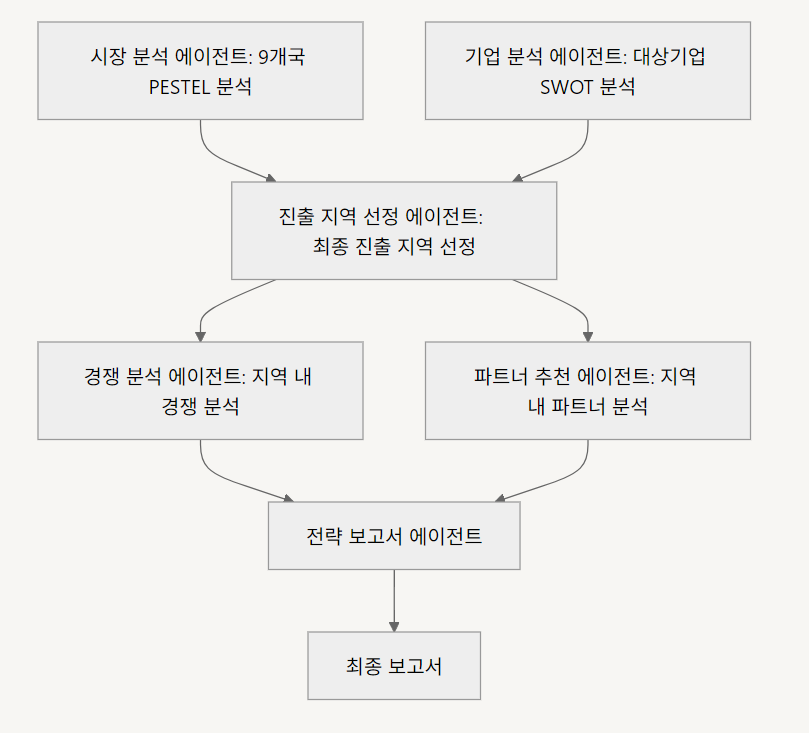

# 글로벌 진출 전략 프로젝트
본 프로젝트는 글로벌 시장 진출 전략 에이전트를 설계하고 구현한 실습 프로젝트입니다.

## 개요

- 프로젝트 목적 : 글로벌 시장으로의 진출을 목표로 하고 있는 국내 AI 스타트업에게 글로벌 진출 전략을 제공합니다.
                 AI 에이전트의 신속,정확한 전략 제안을 기반으로 의사 결정에 투입되는 비용을 효과적으로 절감하고자 합니다.  
- 수행 방안 : 멀티 에이전트 기반 RAG 
- Tools : Tavily 웹서치, LLM 기반 요약/분석, 프롬프트 엔지니어링, 정보 정합성/스코어링, 에이전트 프레임워크 

## 특징

- 멀티 에이전트 기반 글로벌 시장·기업 분석 자동화: 다양한 AI 에이전트가 시장 환경 분석(PESTEL), 기업 분석(강점/약점), 시장 내 경쟁 환경, 파트너사 등 각종 정보를 웹 스크래핑과 LLM 기반으로 신속·정확하게  분석합니다
- 정량적 평가 및 진출 최적 지역 자동 추천: 분석 결과를 정보 정합성·스코어링 알고리즘을 통해 진출에 가장 적합한 시장을 자동으로 선정합니다.(프로젝트 초기 목표는 AI 산업 성장성이 높은 10개국을 대상으로 분석을 진행하려 했으나, 투입되는 비용을 고려하여 대표적인 시장인 미국, 중국 2개국으로 한정했습니다. )
- 전략 종합 보고서 자동 생성 및 문서화: 수집·분석된 모든 데이터를 종합하여 맞춤형 진출 전략 보고서를 자동 작성(PDF/문서화)하여 의사결정에 바로 활용할 수 있도록 제공합니다.

## Tech Stack 
| Category   | Details                      |
|------------|------------------------------|
| Framework  | LangGraph, LangChain, Python |
| LLM        | GPT-4o-mini via OpenAI API   |

## 멀티 에이전트
 
- 시장 분석 Agent: 목표 시장의 AI 산업과 관련한 시장 동향 정보 수집, PESTEL 분석. 
- 기업 Agent: 대상 기업 정보 수집, 강점/약점 분석.
- 진출 지역 선정 Agent: 상기 Agent들의 결과를 바탕으로 정량적인 평가/비교를 수행, 기업에게 가장 적합한 진출 국가를 선정
- 경쟁 분석 Agent: 선정된 진출 지역 내 경쟁 상황 정보 수집
- 파트너 분석 Agent: 선정된 진출 지역 내 파트너 후보 정보 수집 
- 전략 보고서 작성 Agent: 전체 분석 결과와 전략적 인사이트를 종합하여, 맞춤형 진출 전략 보고서 작성·정리

## State 
    market: Annotated[Sequence[BaseMessage], add_messages]   # 시장 분석 에이전트 
    market_sources: Annotated[Sequence[BaseMessage], add_messages] # 웹 서칭 출처
    company: Annotated[Sequence[BaseMessage], add_messages] # 기업 분석 에이전트
    company_sources: Annotated[Sequence[BaseMessage], add_messages] # 웹 서칭 출처       
    selected_country: Annotated[Sequence[BaseMessage], add_messages] # 진출 지역 선정 agent
    selection_results: Annotated[Sequence[BaseMessage], add_messages] # 선정 결과 
    competitors: Annotated[Sequence[BaseMessage], add_messages] # 경쟁 환경 분석 에이전트
    competitors_sources: Annotated[Sequence[BaseMessage], add_messages] # 웹 서칭 출처     
    partners: Annotated[Sequence[BaseMessage], add_messages] # 파트너 분석 에이전트 
    partners_sources: Annotated[Sequence[BaseMessage], add_messages] # 웹 서칭 출처     
    report: Annotated[Sequence[BaseMessage], add_messages] # 보고서 작성 에이전트

## 에이전트 아키텍처

## 디렉토리 구조
<pre><code>
AI_MINI_PROJECT/
│
├── .env
├── main.py
├── prompt_templates.py
├── README.md
├── state.py
│
├── agent/
│   ├── company_analysis_agent.py
│   ├── competition_analysis_agent.py
│   ├── market_analysis_agent.py
│   ├── partner_analysis_agent.py
│   ├── region_selection_agent.py
│   └── report_writing_agent.py
</code></pre>

## 보고서(최종 산출물) 양식

    서론
        - 보고서 전체 내용 요약 (4줄 내외)
    
    본론
        - 1. 기업 분석 (강점/약점)
        - 2. 시장 분석 (미국/중국 PESTEL 비교)
        - 3. 적합도 평가 (과정 및 점수 근거 상세)
        - 4. 경쟁 분석
        - 5. 파트너 분석
    
    결론
        - 전략 제안 및 근거 
    
    출처 및 참고자료

## Contributors 
- 정선웅
